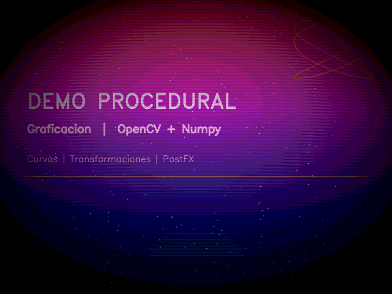
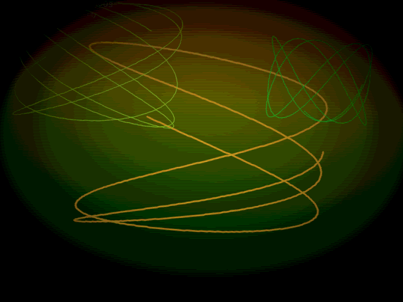
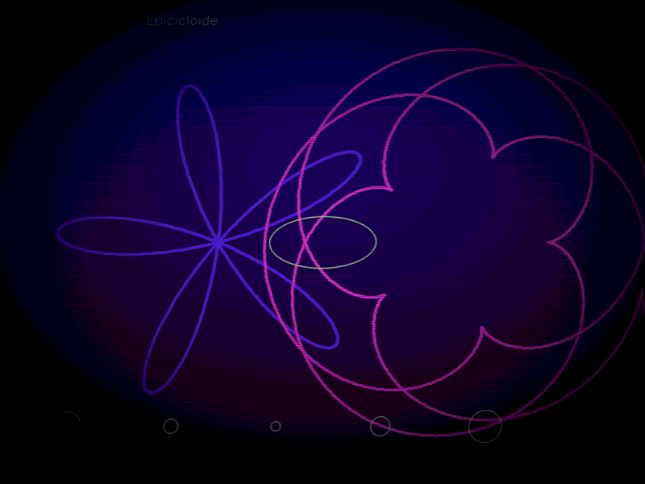
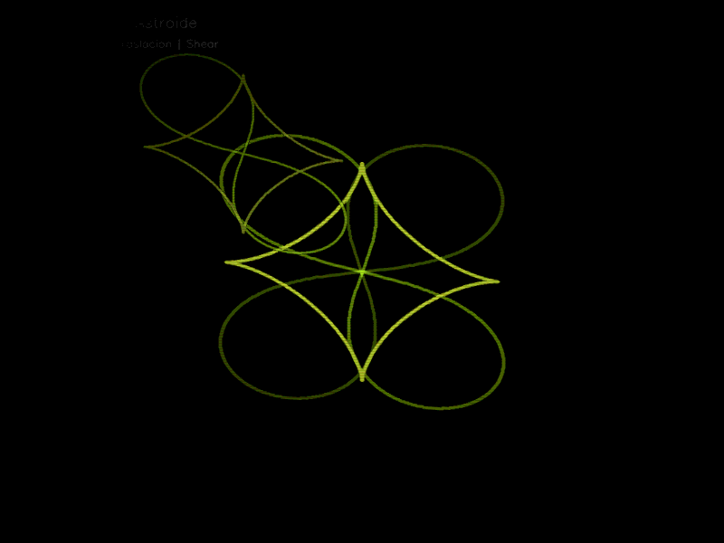
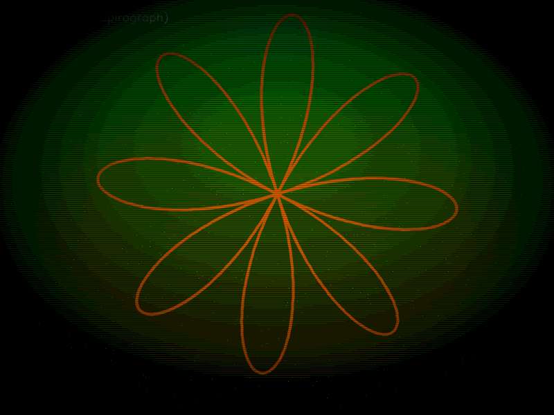
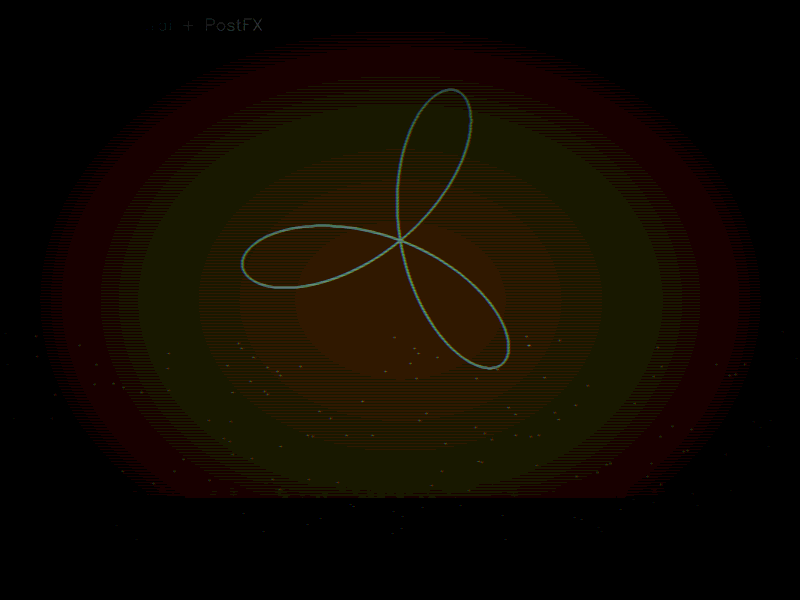

# Proyecto Final: Demo Procedural con OpenCV

---

## Portada

| | |
|---|---|
| **Nombre completo** | [Nombre] |
| **Grupo** | [Grupo] |
| **Materia** | Graficación |
| **Proyecto** | Demo Procedural con OpenCV |
| **Fecha** | Mayo 2026 |

---

## Objetivo de la práctica

Construir un **demo procedural** de 60 segundos usando únicamente Python, NumPy y OpenCV. Todo lo visual se genera en tiempo real mediante ecuaciones y algoritmos — sin texturas externas, sin modelos importados ni imágenes precargadas. El objetivo es demostrar el uso de curvas paramétricas, transformaciones afines y efectos de post-procesamiento dentro de un sistema de escenas controlado por una timeline.

---

## Timeline de escenas

El demo se divide en **6 escenas de 10 segundos** cada una, con transiciones de **crossfade de 1.2 s** entre ellas y un fade global de entrada/salida.

| # | Escena | Tiempo | Descripción |
|---|--------|--------|-------------|
| 0 | **Credits / Intro** | 0 – 10 s | Fondo de estrellas deterministas + texto animado + Lissajous decorativo |
| 1 | **Lissajous** | 10 – 20 s | 3 figuras de Lissajous simultáneas con parámetros animados + rotación afín |
| 2 | **Rosa polar + Epicicloide** | 20 – 30 s | Rosa polar k=5 y epicicloide (R=5, r=3) + círculos pulsantes + shear |
| 3 | **Lemniscata + Astroide** | 30 – 40 s | Escena dedicada a transformaciones: espejo, escala+traslación, shear |
| 4 | **Spirograph + Partículas** | 40 – 50 s | Hipotrocoide animada con campo de partículas y scanlines |
| 5 | **Fuego Procedural** | 50 – 60 s | Simulación de fuego con heatmap HSV + aberración cromática |

Las transiciones usan `cv2.addWeighted` con alpha animado mediante `smoothstep`, lo que produce un cruce suave entre escenas sin cortes abruptos.

---

## Curvas paramétricas implementadas (mínimo 6)

Todas se generan con `np.linspace` sobre el parámetro `t` y se dibujan con `cv2.polylines`.

### 1. Figuras de Lissajous — Escena 1

```
x(t) = sin(a·t + δ)
y(t) = sin(b·t)
```

Los parámetros `a`, `b` y `δ` se animan con `sin(t)` y `cos(t)`, haciendo que la figura evolucione continuamente. Se dibujan 3 instancias en simultáneo con distintos valores.

### 2. Rosa polar — Escena 2

```
r(θ) = cos(k·θ)    con k = 5
x = r · cos(θ + θ₀)
y = r · sin(θ + θ₀)
```

El ángulo de rotación `θ₀ = t · 0.5` hace que la rosa gire lentamente.

### 3. Epicicloide — Escena 2

```
x(t) = (R+r)·cos(t) − r·cos((R+r)/r · t)
y(t) = (R+r)·sin(t) − r·sin((R+r)/r · t)
```

Con R=5, r=3. Representa el movimiento de un punto sobre un círculo que rueda alrededor de otro.

### 4. Lemniscata de Bernoulli — Escena 3

```
r² = a²·cos(2θ)   →   r = a·√(cos(2θ))   (solo donde cos(2θ) ≥ 0)
x = r · cos(θ + θ₀)
y = r · sin(θ + θ₀)
```

La condición `cos(2θ) ≥ 0` se maneja con una máscara booleana en NumPy para evitar raíces de negativos.

### 5. Astroide — Escena 3

```
x(t) = cos³(t)
y(t) = sin³(t)
```

Caso especial de hipotrocoide. Produce una figura de 4 cúspides simétricas.

### 6. Hipotrocoide (Spirograph) — Escenas 4 y 5

```
x(t) = (R−r)·cos(t) + d·cos((R−r)/r · t + φ)
y(t) = (R−r)·sin(t) − d·sin((R−r)/r · t + φ)
```

Con R=8, r=3, d=5. El ángulo de fase `φ` se anima con `sin(t)` para deformar el patrón con el tiempo.

---

## Transformaciones afines implementadas (mínimo 2)

Todas usan `cv2.warpAffine(img, M, (W, H))` con matrices 2×3 construidas manualmente o con helpers de OpenCV.

### 1. Rotación — Escena 1

```python
M = cv2.getRotationMatrix2D(center, angle_deg, 1.0)
```

El ángulo es `8 · sin(t · 0.4)` grados, produciendo un balanceo suave del frame completo. Se nota claramente porque las curvas de Lissajous oscilan como si estuvieran colgadas.

### 2. Shear horizontal y vertical — Escenas 2 y 3

```
M = [[1,   shx,  −shx·H/2],
     [shy,  1,   −shy·W/2]]
```

El desplazamiento central (`−shx·H/2`) compensa el shear para que la figura no salga del cuadro. En Escena 2 se usa shear horizontal animado; en Escena 3, shear vertical.

### 3. Espejo horizontal — Escena 3

```python
mirrored = cv2.flip(img, 1)
frame = cv2.addWeighted(original, 0.6, mirrored, 0.4, 0)
```

Se combina el buffer original con su versión espejada usando `addWeighted`. El resultado es una composición simétrica que revela la estructura de la lemniscata y la astroide.

### 4. Escala + Traslación — Escena 3

```
M = [[sx,  0,  tx],
     [ 0,  sy, ty]]
```

Con `sx = sy = 0.55 + 0.2·sin(t·0.8)` y `tx, ty` animados. Produce una versión más pequeña y desplazada de la curva que se superpone al original solo donde hay píxeles (composición por máscara).

---

## Capturas de pantalla por escena

> *Las imágenes se encuentran en la carpeta `renders/` junto al código.*

**Escena 0 — Credits / Intro**


**Escena 1 — Lissajous**


**Escena 2 — Rosa polar + Epicicloide**


**Escena 3 — Lemniscata + Astroide (Transformaciones)**


**Escena 4 — Spirograph + Partículas**


**Escena 5 — Fuego Procedural**


---

## Tabla comparativa de filtros / post-procesamiento

| Filtro | Función en código | Cómo funciona | Dónde se aplica | Efecto visual |
|--------|------------------|---------------|-----------------|---------------|
| **Viñeta** | `post_vignette` | Máscara radial `1 − strength·r²` multiplicada al frame | Global (todos los frames) | Oscurece las esquinas, da sensación de profundidad |
| **Scanlines** | `post_scanlines` | Modulación `1 − s·(0.5 + 0.5·sin(2π·y/3))` por fila | Global + Escena 4 extra | Simula líneas horizontales de pantalla CRT |
| **Posterización** | `post_posterize` | `(img // q) * q` con q=24 | Global (todos los frames) | Reduce la paleta, da estética retro/flat |
| **Aberración cromática** | `post_chromatic_aberration` | Desplaza canal R hacia la derecha y canal B hacia la izquierda | Solo Escena 5 | Simula dispersión óptica, refuerza el efecto de calor del fuego |

---

## Primitivas de dibujo utilizadas

| Primitiva | Escenas | Uso |
|-----------|---------|-----|
| `cv2.polylines` | Todas | Dibujar todas las curvas paramétricas |
| `cv2.circle` | 2 | Círculos pulsantes como "beats" visuales |
| `cv2.ellipse` | 2 | Elipse decorativa animada en rotación |
| `cv2.rectangle` | 5 | Suelo negro en la base del fuego |
| `cv2.line` | 0 | Línea decorativa horizontal en los créditos |
| `cv2.putText` | Todas | Etiquetas de escena y ecuaciones |
| `cv2.addWeighted` | Todas | Composición por capas y transiciones crossfade |
| `cv2.GaussianBlur` | 0, 4, 5 | Suavizado de estrellas, partículas y fuego |

---

## Respuestas a preguntas de análisis

**¿Por qué usar coordenadas paramétricas en lugar de cartesianas directas?**
Porque curvas como la lemniscata, la rosa polar o la epicicloide no se pueden expresar fácilmente como `y = f(x)`. La representación paramétrica `(x(t), y(t))` permite recorrer la curva de forma continua con un solo parámetro `t`, lo que es natural para animación en tiempo real.

**¿Qué ventaja tiene usar matrices afines con `cv2.warpAffine` en lugar de transformar los puntos manualmente?**
`warpAffine` aplica la transformación a todos los píxeles del frame en una sola operación vectorizada en C++, lo que es mucho más rápido que iterar punto por punto en Python. Además, permite combinar rotación, escala, traslación y shear en una sola matriz 2×3.

**¿Por qué el fuego se ve más realista con un heatmap acumulativo?**
Porque el calor no aparece y desaparece instantáneamente: se acumula, se difunde (blur gaussiano) y se disipa gradualmente (`heat *= 0.93`). El desplazamiento hacia arriba de filas simula la convección — el calor sube — y el mapeo HSV convierte la intensidad en color de forma perceptualmente continua (rojo → amarillo → blanco).

**¿Por qué se usa `smoothstep` para las transiciones en lugar de una interpolación lineal?**
`smoothstep` produce derivada cero en los extremos (`t=0` y `t=1`), lo que elimina el efecto de "arranque brusco" que tiene la interpolación lineal. Las transiciones se perciben más suaves porque la velocidad de cambio empieza lenta, acelera al centro y vuelve a desacelerar al final.

---

## Conclusión final

El proyecto cumplió con todos los requisitos de la práctica: 6 escenas controladas por timeline, 6 curvas paramétricas distintas dibujadas con `cv2.polylines`, 4 transformaciones afines visibles aplicadas con `cv2.warpAffine`, múltiples filtros de post-procesamiento y exportación a `.mp4` con `VideoWriter`.

Lo más interesante del proceso fue ver cómo ecuaciones matemáticas simples — una función seno, una exponencial de decaimiento, un cambio de coordenadas polares a cartesianas — generan imágenes complejas y visualmente ricas sin ningún asset externo. Eso es exactamente lo que hace valioso el enfoque procedural: el contenido emerge de las matemáticas, no de recursos importados.

Como área de mejora, el sistema de partículas podría beneficiarse de un buffer de acumulación (en lugar de regenerar posiciones cada frame) para producir trazas más largas y fluidas.

---

## Cómo correr el proyecto

```bash
# Instalar dependencias
pip install numpy opencv-python

# Preview en ventana (ESC para salir, E para exportar)
python demo.py

# Exportar directamente a renders/demo_final.mp4
python demo.py --export
```

**Archivos entregados:**
- `demo.py` — código ejecutable principal
- `REPORTE.md` — este archivo
- `renders/` — capturas de cada escena + video final
