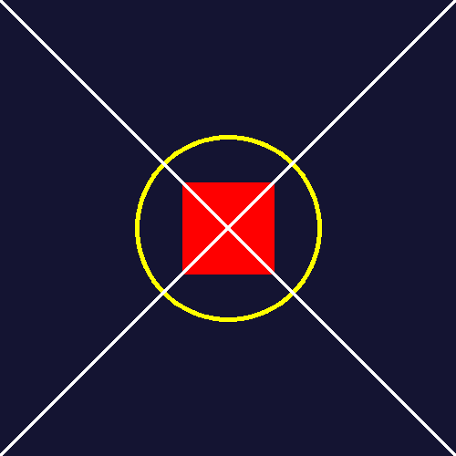
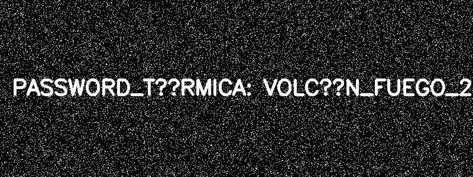

# Reporte de Misión: Graficación Táctica
**Agente Especial:** José Luis Medina Ramírez / 24120350

---

# Evidencias de Misión

## Misión 1 – Mensaje Subexpuesto

Se aplicó un operador puntual inverso multiplicando los píxeles por 50 para recuperar el mensaje oculto.

```python

#=============================================================================================

# Mision 1 codigo 

import cv2
import numpy as np

img = cv2.imread(r"C:\Users\ramjo\Downloads\m1_oscura.png", cv2.IMREAD_GRAYSCALE)

if img is None:
    print("Error: no se pudo cargar la imagen")
    exit()

h, w = img.shape
print("Tamaño:", w, "x", h)

resultado_raw = np.zeros((h, w), dtype=np.uint8)

for y in range(h):
    for x in range(w):
        valor = int(img[y, x]) * 50
        if valor > 255:
            valor = 255
        resultado_raw[y, x] = valor

resultado_opencv = np.clip(img.astype(np.int32) * 50, 0, 255).astype(np.uint8)

cv2.imwrite("m1_raw.png", resultado_raw)
cv2.imwrite("m1_opencv.png", resultado_opencv)

cv2.imshow("Original", img)
cv2.imshow("Resultado RAW", resultado_raw)
cv2.imshow("Resultado OpenCV", resultado_opencv)

cv2.waitKey(0)
cv2.destroyAllWindows()
```
## Resultado Misión 1


#=============================================================================================
```python
# Mision 2 codigo 

import cv2
import numpy as np

mitad1 = cv2.imread(r"C:\Users\ramjo\Downloads\m2_mitad1.png")
mitad2 = cv2.imread(r"C:\Users\ramjo\Downloads\m2_mitad2.png")

if mitad1 is None or mitad2 is None:
    print("Error cargando imágenes")
    exit()

lienzo = np.ones((400,400,3), dtype=np.uint8) * 255

h1, w1 = mitad1.shape[:2]

M = np.float32([
[1,0,0],
[0,1,0]
])

pieza1 = cv2.warpAffine(mitad1, M, (400,400))

lienzo[0:h1,0:w1] = mitad1

h2, w2 = mitad2.shape[:2]

centro = (w2//2, h2//2)

M_rot = cv2.getRotationMatrix2D(centro,180,1)

mitad2_rotada = cv2.warpAffine(mitad2, M_rot,(w2,h2))

lienzo[200:200+h2,0:w2] = mitad2_rotada

cv2.imshow("Mitad1",mitad1)
cv2.imshow("Mitad2",mitad2)
cv2.imshow("QR reconstruido",lienzo)

cv2.imwrite("m2_qr_completo.png",lienzo)

cv2.waitKey(0)
cv2.destroyAllWindows()
```
## Resultado Misión 2


#=============================================================================================
```python
# Mision 3 codigo 

import cv2
import numpy as np

# lienzo azul oscuro BGR(50, 20, 20)
img = np.full((500, 500, 3), (50, 20, 20), dtype=np.uint8)

# círculo amarillo
cv2.circle(img, (250, 250), 100, (0, 255, 255), 3)

# rectángulo rojo sólido
cv2.rectangle(img, (200, 200), (300, 300), (0, 0, 255), -1)

# diagonales blancas
cv2.line(img, (0, 0), (499, 499), (255, 255, 255), 2)
cv2.line(img, (499, 0), (0, 499), (255, 255, 255), 2)

cv2.imwrite("m3_sello_forjado.png", img)

cv2.imshow("Sello", img)
cv2.waitKey(0)
cv2.destroyAllWindows()
```
## Resultado Misión 3


#=============================================================================================
```python
# Mision 4 codigo 

import cv2
import numpy as np

img = cv2.imread(r"C:\Users\ramjo\Downloads\m4_ruido.png")

if img is None:
    print("Error: no se pudo cargar la imagen")
    exit()

hsv = cv2.cvtColor(img, cv2.COLOR_BGR2HSV)

bajo = np.array([80,100,100])
alto = np.array([100,255,255])

mascara = cv2.inRange(hsv,bajo,alto)

cv2.imshow("Imagen original",img)
cv2.imshow("Mascara CYAN",mascara)

cv2.imwrite("m4_mascara.png",mascara)

cv2.waitKey(0)
cv2.destroyAllWindows()
```
## Resultado Misión 4


#=============================================================================================
```python
# Mision 5 codigo 

import cv2
import numpy as np
import math

img = np.zeros((500, 500, 3), dtype=np.uint8)

t = 0.0
while t <= 2 * math.pi:
    x = int(250 + 150 * math.sin(3 * t))
    y = int(250 + 150 * math.sin(2 * t))

    cv2.circle(img, (x, y), 1, (255, 255, 255), -1)
    t += 0.01

cv2.imwrite("m5_antena.png", img)

cv2.imshow("Curva Parametrica", img)
cv2.waitKey(0)
cv2.destroyAllWindows()

```
## Resultado Misión 5

#=============================================================================================
```python

#Análisis del Analista (Reflexiones Finales)

#1️Operadores Puntuales (Misión 1)

#Si en lugar de multiplicar por 50 se hubiera sumado 50 a cada píxel, el contraste no se recuperaría correctamente. La multiplicación amplifica proporcionalmente los valores de intensidad originales, mientras que la suma solo desplaza los valores, lo que podría saturar rápidamente la imagen sin revelar correctamente los detalles ocultos.

#=============================================================================================

#2️Espacio HSV (Misión 4)

#El modelo BGR mezcla información de color e intensidad, lo que dificulta aislar colores específicos. En cambio, HSV separa el tono (Hue) de la iluminación, permitiendo seleccionar rangos de color más fácilmente. Por esta razón, HSV es más eficiente para detectar colores específicos en imágenes con ruido.

#=============================================================================================

#3️Ecuaciones Paramétricas (Misión 5)

#Las ecuaciones paramétricas permiten describir curvas complejas utilizando un solo parámetro (t). Esto facilita generar trayectorias continuas y formas cerradas como curvas de Lissajous, ya que se puede controlar simultáneamente las coordenadas x e y a partir del mismo parámetro.

