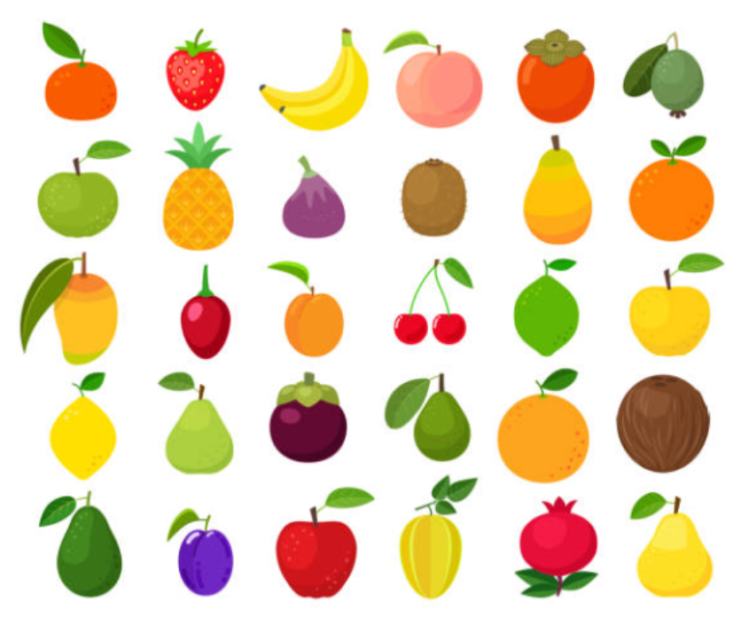
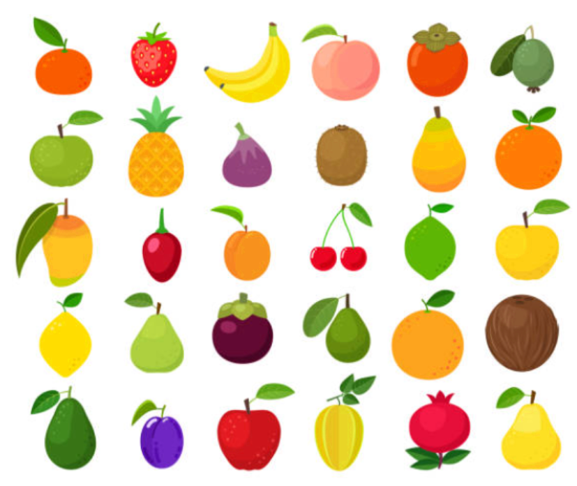
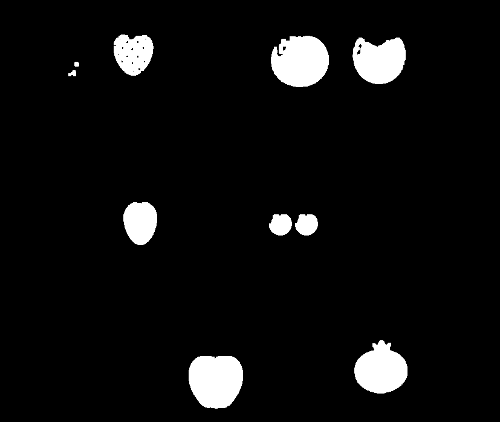

# Segmentación de Frutas usando Máscara HSV

## Nombre:
José Luis Medina Ramírez

## Materia:
Graficación

## Objetivo
Aplicar el modelo HSV para segmentar frutas por color, limpiar ruido y contar regiones conectadas.

---

# Actividad 1: Exploración HSV (Rojo)

## Capturas

Imagen original:

Imagen en HSV:

Máscara rojo:

Máscara rojo limpia:

---

## Resultados

Regiones totales (incluyendo ruido): 10  
Frutas detectadas: 8  

Áreas aproximadas:
- 3385
- 6407
- 5205
- 3138
- 1051
- 1053
- 5433
- 6505

---

## Reflexión

- Si el rango HSV es muy estrecho, partes de la fruta no se detectan.
- Si el rango es muy amplio, aparece ruido y se detectan objetos que no son frutas.

---

(Después agregaremos verde y amarillo aquí)
